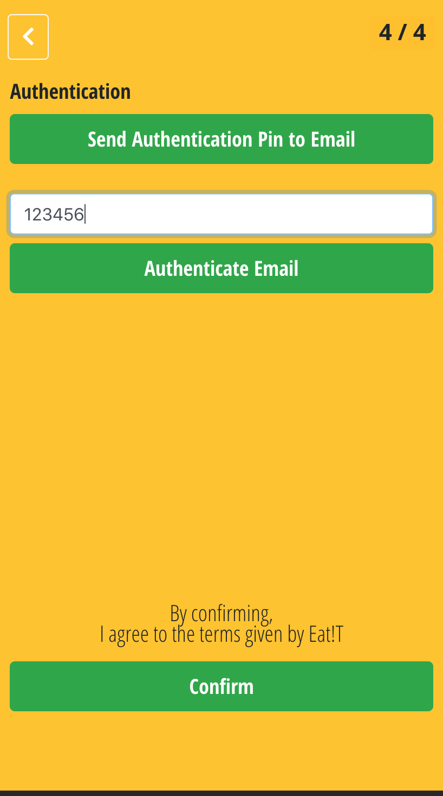

<h2>Denison Enterprises Project: Eat!T</h2>
Eat!T allows college students and staffs to order food in the mobile devices
and pick up when order is complete.
 
It is made with Ionic React, AWS Amplify, Firebase.
This project is to be launched in August. This markdown
will be updated as more pages are complete.
<h2>Screenshots</h2>
This is Sign In Screen.

These are Sign Up Screens.

    
    
    

    
    

